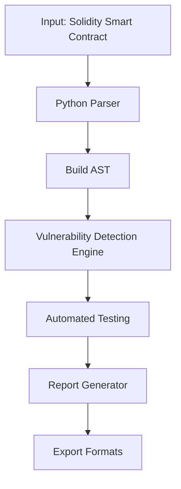

# Introduction

# Blockchain Security Project: Smart Contract Vulnerability Scanner

## Project Overview
An interactive tool that analyzes Solidity smart contracts for security vulnerabilities using Python, DevSecOps practices, and blockchain testing frameworks.

<details>
<summary>🔍 Project Architecture</summary>


-----------------------------------------------------------
## Stages - 

### Problem Statement 
https://owasp.org/www-project-smart-contract-top-10/2025/en/src/SC05-reentrancy-attacks.html
A reentrancy attack exploits the vulnerability in smart contracts when a function makes an external call to another contract before updating its own state. This allows the external contract, possibly malicious, to reenter the original function and repeat certain actions, like withdrawals, using the same state. Through such attacks, an attacker can possibly drain all the funds from a contract.

``` java
// SPDX-License-Identifier: MIT
pragma solidity ^0.8.0;

contract Solidity_Reentrancy {
    mapping(address => uint) public balances;

    function deposit() external payable {
        balances[msg.sender] += msg.value;
    }

    function withdraw() external {
        uint amount = balances[msg.sender];
        require(amount > 0, "Insufficient balance");

        // Vulnerability: Ether is sent before updating the user's balance, allowing reentrancy.
        (bool success, ) = msg.sender.call{value: amount}("");
        require(success, "Transfer failed");

        // Update balance after sending Ether
        balances[msg.sender] = 0;
    }
}
```
### Setup environment
``` bash
pip install web3 py-solc-x slither-analyzer
npm install -g ganache hardhat
```
### Week 3-4: Build Core Scanner
TODO

### Week 5-6: Testing Framework
TODO 

### Week 7-8: CI/CD Integration

-----------------------------------------------------------


